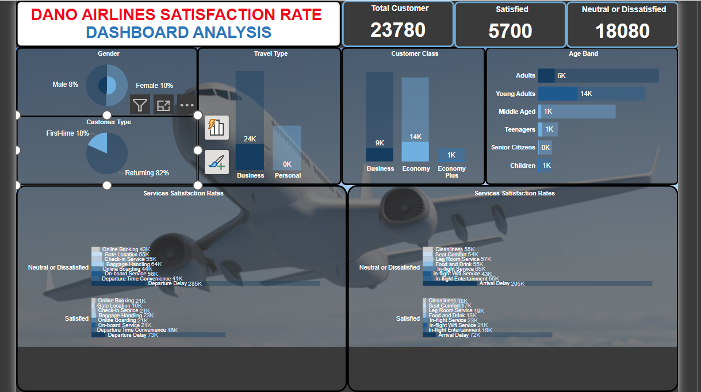
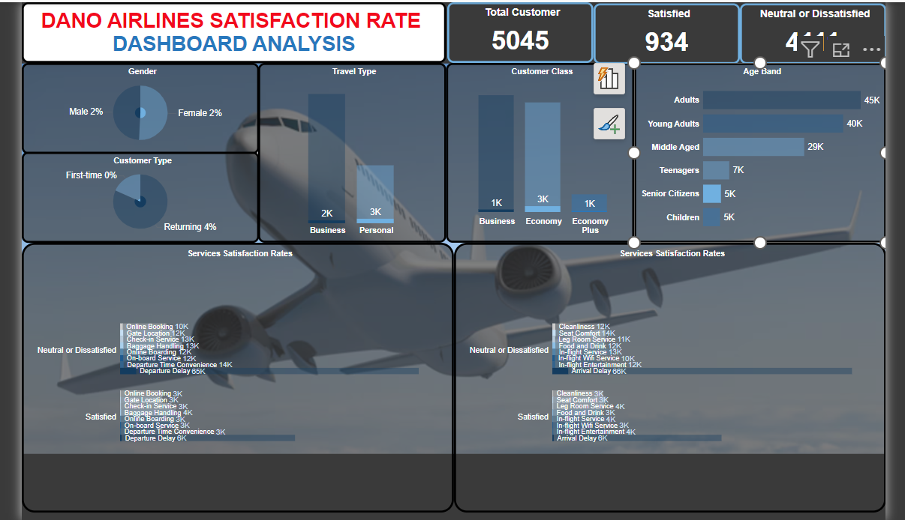

# Dano-Airlines-Customer-Satisfaction-Survey

## Introduction
This is a power Bi project on customer satisfaction survey of a Uk-based airline
headquartered in London, United Kingdom called **Dano Airlines**. This project is to analyze and recommend a data-driven strategy for increasing Dano Airlines' satisfaction rate,
and present it in the form of a single page report or dashboard.

**_Disclaimer_**:This dataset is for my final capstone project on my data analytics training to demonstrate my capabilities on power Bi. 

## Problem statement:
- The latest passenger survey results just came in and it looks
like the satisfaction rate dipped under 50% for the first time ever. The leadership team needs to take
action fast, so they've brought you in to analyze the data and find the key areas to focus on for getting
back on track.

## Skills/concept demonstrated:
The following power Bi features were incorporated;
- Data Cleaning and Transformation
- Modelling
- DAX
- Measures
- Data Visualization
- Problem Solving

## Tool used:
- Power BI

## Modelling:
There were no automatically derived relationships, so i adjusted to add the required relationships.

Auto Model                                           |         Adjusted Model
:---------------------------------------------------:|:------------------------------------------------------------:
                                  |

- This model is a star schema.
- There is 1 dimension table and 1 fact table. 
- The dimension table is joined to the fact table with a one relationship.

## Visualization:
The report comprises 4 key insights:
- 1:Customer type
- 2:Travel type
- 3:Customer class
- 4:Age band

You can interact with the report here [https://app.powerbi.com/view?r=eyJrIjoiNTAxNzdmOWMtYWNhZC00NDEzLTk5YTItNDE1OWRiNWRmOTk4IiwidCI6IjE4MTk3OTFkLTFhZjUtNDZiMC1iNDQ3LWFiYWMwMzVjZjQzYiJ9](https://app.powerbi.com/view?r=eyJrIjoiNTAxNzdmOWMtYWNhZC00NDEzLTk5YTItNDE1OWRiNWRmOTk4IiwidCI6IjE4MTk3OTFkLTFhZjUtNDZiMC1iNDQ3LWFiYWMwMzVjZjQzYiJ9)

Dashboard                                                       |      Dasboard report
:--------------------------------------------------------------:|:------------------------------------------------------------:
                                              |

## Features:
By clicking on the customers information (Gender, Customer type, Travel type ,Customer class and Age distribution)  you get to see each category's satisfaction levels on each of the services grouped into two

## Insights:
- A total of 129,880 passengers were surveyed and 56428 out of them reported satisfied while 73452 expressed neutral or dissatisfied sentiment about their experiences.

- In terms of customer loyalty, 82% are returning customers  indicating high rate of repeat business while 18% are first time flying customers.

## Analysis:
### Customer type

Returning                                                      |      First time
:--------------------------------------------------------------:|:------------------------------------------------------------:
                                              |

- Returning customers only expressed great deal of dissatisfaction on the departure and arrival delay and were mostly satisfied with the rest of the services but the reverse was the case for first time customers as a higher number of them expressed neutral or dissatisfaction on the overall services.
- **_Recommendation_**:More attention should be given to first time customers in the overall services to improve their experience while departure and arrival delay should be worked on for returning customers.

### Travel type:

Business                                                        |       Personal
:--------------------------------------------------------------:|:------------------------------------------------------------:
                                   |

- Those travelling for business were greatly satisfied with their experience and majority of them flew business class while those travelling for personal reasons were greatly dissatisfied and they were mostly in economy class and economy plus.

### Customer class:

Business                                                        |         Economy class                                   |       Economy plus
:--------------------------------------------------------------:|:-------------------------------------------------------:|:-----------------------------------------------------:
                                |                          |

- A significant proportion of the satisfied passengers belonged to the business class, while the majority of those expressing neutral or dissatisfied opinions were in the economy class and economy plus. specific attention can be directed towards improving experiences for economy and economy plus passengers.
- **_Recommendation_**:Strategies may include focusing on online booking, check-in services, baggage handling,  seat comfort, in-flight entertainment, and food and drink.

### Age band:

Senior citizens                                                 |     Children
:--------------------------------------------------------------:|:------------------------------------------------------------:
                               |

- Senior citizens and the children expressed the highest rate of neutral or dissatisfied. 
- **_Recommendation_**:More attention should be paid to them as they are elderly and children.

### Conclusion:
- There is an overall expression of high rate of dissatisfaction on the departure and arrival delay, so the company may consider starting from there to improve their customer ratings and experiences.
